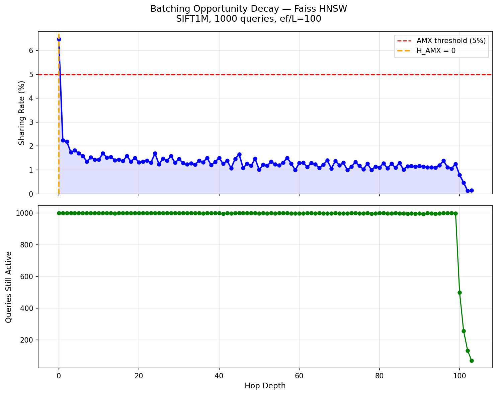
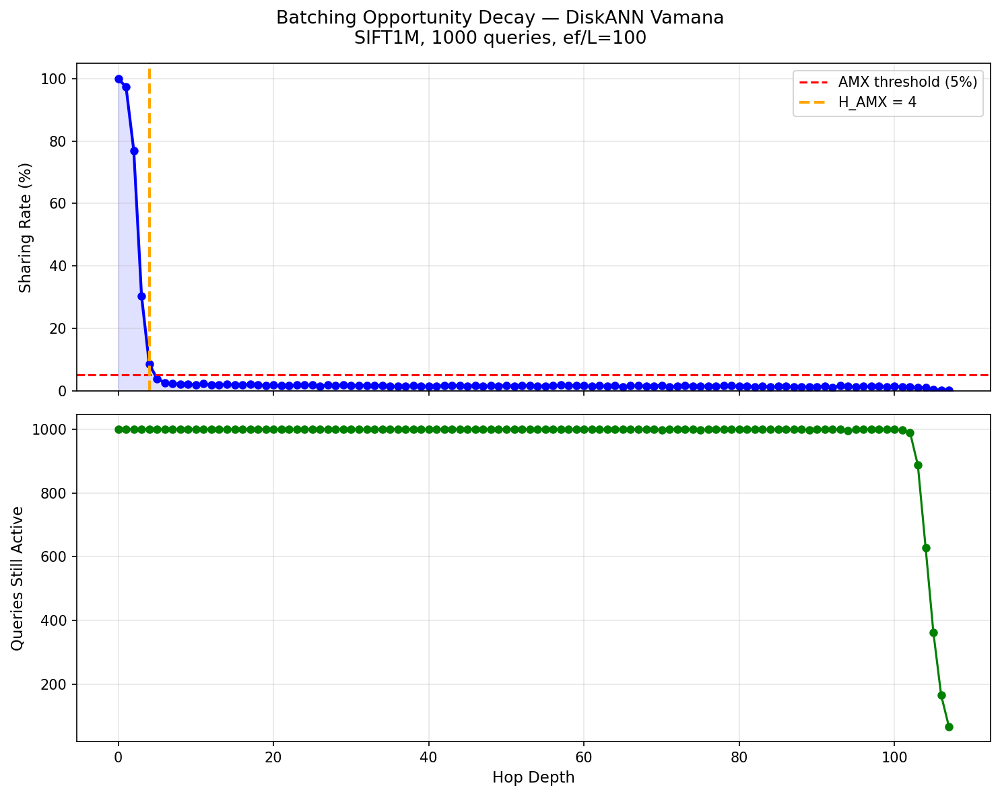
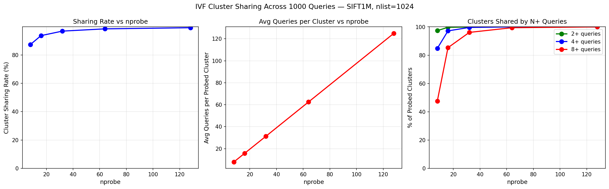
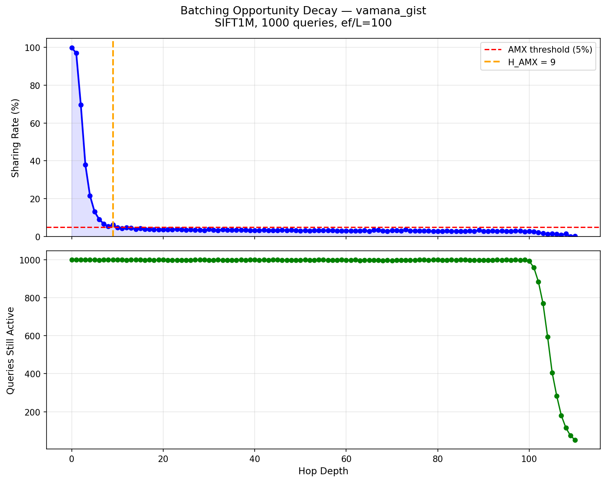
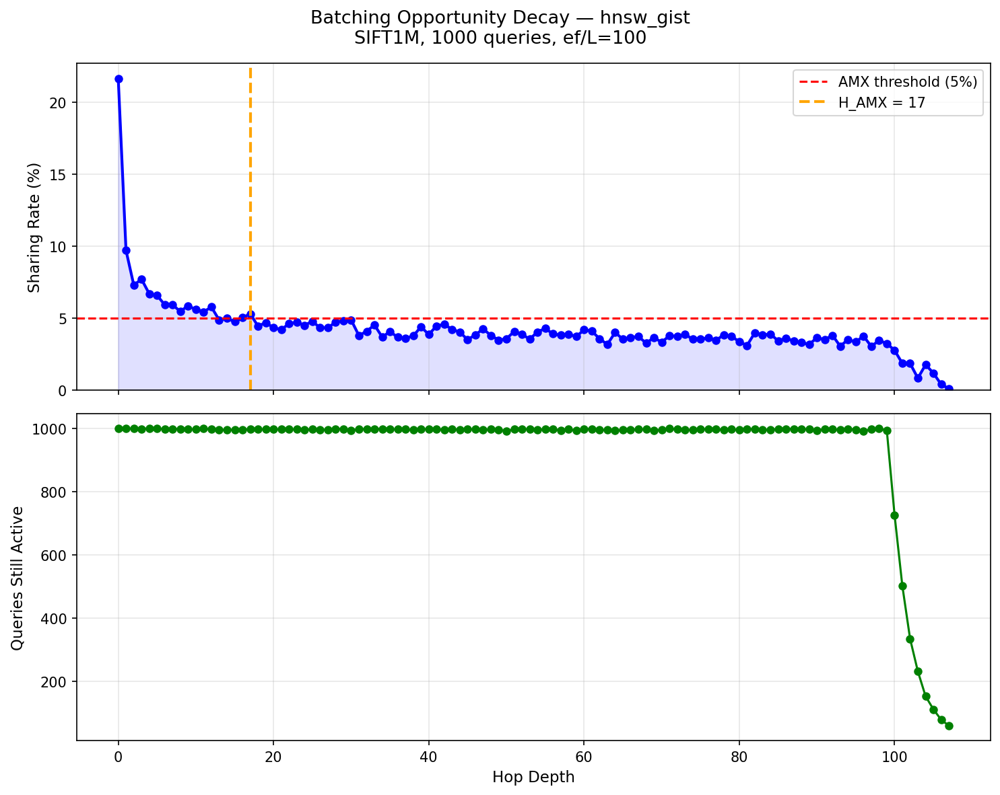

# AMX Graph ANNS

Characterizing and accelerating graph-based approximate nearest
neighbor search with Intel AMX.

NJIT Honors Summer Research Initiative 2026
Advisor: Prof. Xiaoning Ding

---

## ⚠ Critical AMX Requirement

**AMX tile registers require explicit OS permission before use.** Without
the following syscall, MKL silently routes all BF16 GEMM calls to
AVX-512 — AMX tiles never fire regardless of matrix size or data type:

```cpp
#include <sys/syscall.h>
#define ARCH_REQ_XCOMP_PERM 0x1023
#define XFEATURE_XTILEDATA  18
syscall(SYS_arch_prctl, ARCH_REQ_XCOMP_PERM, XFEATURE_XTILEDATA);
```

Call this once at process startup before any AMX GEMM operations.
This is undocumented in most MKL guides and likely explains why some
published AMX benchmarks underreport AMX's capability. See Phase 7
for the full discovery and verification.

---

## Build & Run

**Entry point:** the batch controller is `amx/medoid_batch_controller.cpp`
(the method) plus `amx/medoid_batch_benchmark.cpp` (the benchmark driver).
Start there.

Prerequisites: Intel oneAPI (MKL + compiler) and DiskANN 0.7.0 at `~/DiskANN`,
built with two patches applied: `vamana_instrumented/diskann_instrumentation.patch`
(hop-logging instrumentation) and `vamana_instrumented/diskann_medoid_hop0_api.patch`
(declares the `search_batch_medoid_hop0` method in `include/index.h`, which the
controller defines out-of-line). See Reproducibility below.

```bash
source /opt/intel/oneapi/setvars.sh

g++ -O3 -march=native -fopenmp -std=c++17 \
    amx/medoid_batch_benchmark.cpp amx/medoid_batch_controller.cpp \
    -I$HOME/DiskANN/include -I/opt/intel/oneapi/mkl/latest/include \
    -L$HOME/DiskANN/build/src -L/opt/intel/oneapi/mkl/latest/lib \
    -L/opt/intel/oneapi/compiler/2026.0/lib \
    -ldiskann -lmkl_rt -liomp5 -lboost_program_options \
    -lpthread -lm -ldl -laio \
    -Wl,-rpath,/opt/intel/oneapi/mkl/latest/lib \
    -Wl,-rpath,/opt/intel/oneapi/compiler/2026.0/lib \
    -o amx/medoid_batch_benchmark

# Run (GIST1M; T=1 is where the effect is measurable):
./amx/medoid_batch_benchmark \
    --index_path_prefix ~/data/gist/gist_index \
    --query_file ~/data/gist/gist_query.bin \
    --gt_file ~/data/gist/gist_groundtruth.bin \
    --K 10 --L 100 --T 1
```

Environment flags: `TRACK_A_TIMING=1` prints phase timing; `TRACK_A_ITERS=N`
sets the iteration count (default 15; 30 used for reported results).

---

## Motivation

Vector databases power modern AI — RAG pipelines, recommendation
systems, semantic search. The core operation is Approximate Nearest
Neighbor Search (ANNS): given a query vector, find the K most similar
vectors among millions. The bottleneck is distance computation:
each query computes distances to hundreds of database vectors, one
small matrix-vector multiply (GEMV) at a time. These operations are
memory-bound and leave modern CPU compute idle.

Intel AMX (Advanced Matrix Extensions) on Granite Rapids can execute
large matrix-matrix multiplies (GEMM) at extremely high throughput —
but only when many queries compute distances to the same database
vectors simultaneously, so the work can be fused into one GEMM.

CABANA (IEEE CAL 2025) proved this works for IVF-based ANNS, where
the cluster structure guarantees queries share vectors. Whether it
works for graph-based ANNS — the dominant index type in production —
was an open question. Graph traversal is query-dependent: each query
walks its own path. Do concurrent queries ever touch the same nodes
at the same time?

## Research Question

Can the AMX query-batching approach proven for IVF-based ANNS in
CABANA be extended to graph-based ANNS, and what structural properties
of graph algorithms determine the feasibility and magnitude of that
acceleration?

---

## Key Concepts

**Sharing rate at hop h** — the fraction of distance computations at
traversal depth h that are redundant across concurrent queries:
sharing_rate(h) = 1 - unique_nodes_evaluated / total_evaluations

High sharing means multiple queries evaluate the same node at the
same depth — those computations can be fused into one AMX GEMM.

**H_AMX** — the last hop where sharing rate exceeds the 5% usefulness
threshold. H_AMX measures the size of the AMX opportunity window: in
principle a controller could batch hops 0 through H_AMX with AMX GEMM and
fall back to per-query GEMV beyond that depth. The controller actually
implemented in this repo (Phase 9) uses only the structurally-guaranteed
hop-0 batch; batching the full 0..H_AMX window remains a projection, not a
built system. All H_AMX values in this
document are computed at the 5% threshold from clean 1000-query hop
logs using analysis/analyze_decay.py --threshold 0.05.

**Methodology** — we instrumented the distance-computation hot path
of DiskANN (`iterate_to_fixed_point` in index.cpp) and Faiss
(`search_from_candidates` in HNSW.cpp) at C++ source level. Every
distance computation is logged with (query_id, hop_depth, node_id)
using thread-local query tagging. 1000 concurrent queries per run.
Index parameters held constant across all datasets (R=32, L_build=125,
alpha=1.2) so dimensionality and scale are isolated variables.

---

## Results at a Glance

| Algorithm | Dataset   | Dims | Hop 0 Sharing | H_AMX | AMX Opportunity      |
|-----------|-----------|------|--------------|-------|----------------------|
| IVF       | SIFT1M    | 128  | 87-99%       | N/A   | Extremely high       |
| Vamana    | SIFT1M    | 128  | 99.9%        | 4     | Strong in early hops |
| Vamana    | GIST1M    | 960  | 99.9%        | 19    | Extends to 19 hops   |
| Vamana    | SIFT 100M | 128  | 99.9%        | 3     | Scale-invariant      |
| HNSW      | SIFT1M    | 128  | 6.5%         | 0     | None                 |
| HNSW      | GIST1M    | 960  | 21.7%        | 17    | Emerges at high dims |

Three headline findings:

1. **Dimensionality is the dominant factor.** H_AMX grows 6x from
   128d to 960d. Modern AI embeddings (768d-1536d) sit exactly where
   AMX batching matters most.
2. **Scale barely matters.** 100x more vectors moves H_AMX by one hop.
   The opportunity is architectural, not data-dependent.
3. **Vamana structurally dominates HNSW at every dimensionality**
   (4 vs 0 at 128d, 19 vs 17 at 960d) because its fixed medoid entry
   point guarantees hop-0 sharing.

---

## Phase 1: Faiss IndexHNSWFlat

**Algorithm:** HNSW

**Library:** Faiss v1.7.4

**Dataset:** SIFT1M, d=128

**Parameters:** M=16, ef_construction=200, ef_search=100

**Queries:** 1000

**Result:**

Sharing rate at hop 0: 6.47%

H_AMX at 5% threshold: 0

Max hop depth: 103

Sharing never exceeds the AMX efficiency threshold at any depth.
HNSW's upper layer greedy descent disperses queries to different
entry points before layer 0 search begins, eliminating sharing
immediately. Each query's descent path depends on its own vector,
so by the time queries reach layer 0 they are scattered across
hundreds of different graph regions. AMX GEMM batching provides
negligible benefit for Faiss HNSW at 128 dimensions.



---

## Phase 2: DiskANN Vamana

**Algorithm:** Vamana

**Library:** DiskANN 0.7.0

**Dataset:** SIFT1M, d=128

**Parameters:** R=32, L_build=125, alpha=1.2, L_search=100

**Queries:** 1000

**Result:**

| Hop | Sharing Rate |
|-----|-------------|
| 0   | 99.9%       |
| 1   | 97.4%       |
| 2   | 76.9%       |
| 3   | 30.3%       |
| 4   | 8.5%        |
| 5+  | <5%         |

H_AMX at 5% threshold: 4

Max hop depth: 107

All 1000 queries start from the same fixed medoid node and evaluate
the exact same 32 neighbors at hop 0, giving 99.9% sharing. Paths
diverge rapidly, dropping below 5% by hop 5. A strong AMX batching
window exists for hops 0 through 4.

**Analytical result:** hop-0 sharing follows (N-1)/N exactly. With
N concurrent queries all evaluating the same medoid's 32 neighbors:
total evaluations = 32N, unique nodes = 32, so
sharing = (32N - 32)/32N = (N-1)/N. Verified empirically at every
batch size (N=10 gives exactly 90.0%, N=100 gives exactly 99.0%).
The hop-0 AMX opportunity is derivable from first principles.



---

## Phase 3: Faiss IVF (Baseline Validation)

**Algorithm:** IVF

**Library:** Faiss

**Dataset:** SIFT1M, d=128

**Parameters:** nlist=1024, nprobe sweep [8, 16, 32, 64, 128]

**Queries:** 1000

**Result:**

| nprobe | Sharing Rate | Clusters shared by 2+ | Clusters shared by 8+ |
|--------|-------------|----------------------|----------------------|
| 8      | 87.3%       | 97.3%                | 47.6%                |
| 16     | 93.6%       | 99.7%                | 85.3%                |
| 32     | 96.8%       | 99.9%                | 96.1%                |
| 64     | 98.4%       | 100%                 | 99.4%                |
| 128    | 99.2%       | 100%                 | 100%                 |

IVF shows extremely high cluster sharing across all nprobe values.
This reproduces CABANA's findings on SIFT1M and validates our
measurement methodology — when the same instrumentation applied to
graph algorithms gives different answers, those answers are credible.



---

## Phase 4: Granite Rapids Hardware Validation

**Hardware:** Intel Xeon 6767P (Granite Rapids), 256 cores, 251GB RAM
**AMX:** amx_bf16, amx_tile, amx_int8 confirmed

### Vamana Threading Baseline (SIFT1M)

| Threads | QPS     | Recall@10 |
|---------|---------|-----------|
| 1       | 4,589   | 99.14%    |
| 2       | 8,566   | 99.14%    |
| 4       | 12,915  | 99.14%    |
| 8       | 23,093  | 99.14%    |
| 16      | 43,377  | 99.14%    |
| 32      | 80,211  | 99.14%    |
| 64      | 142,097 | 99.14%    |
| 128     | 176,259 | 99.14%    |
| 256     | 109,964 | 99.14%    |

Peak throughput at 128 threads. Performance degrades at 256 threads
due to memory bandwidth saturation, confirming graph ANNS is
memory-bound — more compute does not help; the memory system is the
wall. AMX batching targets this bottleneck by increasing compute
intensity per memory load.

### IVF Threading Baseline (SIFT1M)

| nprobe | QPS     | Recall@10 |
|--------|---------|-----------|
| 1      | 204,491 | 94.90%    |
| 4      | 363,840 | 100%      |
| 8      | 181,729 | 100%      |

IVF upper bound: 363,840 QPS at nprobe=4 with perfect recall — the
proof of what this hardware can do when memory access patterns are
favorable, and the target the batch controller is chasing.

### Additional Threading Baselines

| Dataset   | Peak QPS | Threads | Recall@10 | Notes                       |
|-----------|----------|---------|-----------|-----------------------------|
| GIST1M    | 23,005   | 128     | 88.50%    | 960d, avg degree 24.3       |
| SIFT 100M | 111,069  | 256     | 93.58%    | GT computed on 100M subset  |

GIST1M recall is lower at the same L=100 because the 960d graph is
sparser (avg degree 24.3 vs 30.2) and search is harder; recall is
tunable with higher L and does not affect sharing structure. (The
88.50% here is the T=128 peak-throughput run; the medoid-batch comparison
in Phase 9 uses an 88.31% baseline measured at T=32, L=100 — the same
config the controller is benchmarked against. The small difference is
thread-count / run variance, not an algorithmic change.)

### AMX GEMM Validation (Corrected)

**Note:** AMX requires `arch_prctl(ARCH_REQ_XCOMP_PERM, XFEATURE_XTILEDATA)`
at startup. Without it, `cblas_gemm_bf16bf16f32` silently routes to
AVX-512. Also, FP32 `cblas_sgemm` never uses AMX regardless of matrix
size. See Phase 7 for the full precision findings.

Three-way benchmark (with arch_prctl, T=1, GIST-like 960d, batch=1000):

| Path               | Speedup vs naive |
|--------------------|-----------------|
| FP32 sgemm (AVX-512) | ~1000x (throughput) |
| BF16 gemm (AMX)    | **3.52x over FP32 sgemm** |

AMX speedup scales with graph degree R (larger matrices engage tiles better):

| R   | DIM | Matrix        | AMX vs FP32 sgemm |
|-----|-----|---------------|------------------|
| 32  | 128 | 1000x32x128   | 1.62x            |
| 32  | 960 | 1000x32x960   | 3.52x            |
| 64  | 960 | 1000x64x960   | 4.44x            |
| 128 | 960 | 1000x128x960  | 5.05x            |

Batch sensitivity (GIST-like 960d, single thread, arch_prctl enabled):
- batch=32: 1.27x
- batch=1000: 3.52x
- Cache boundary at batch 64: sub-64 batches are marginal; 64+
  consistently engage AMX tiles for GIST1M-sized vectors. Speedup keeps
  climbing with batch size up to at least batch=10000 (no plateau observed).

**Implication for batch controller:** two operating regimes exist.
Fire at batch <=32 for latency-sensitive workloads. Accumulate
1000+ queries for maximum throughput.

### H_AMX Confirmation

Vamana decay curves regenerated on Granite Rapids confirm H_AMX=4
matches earlier results exactly. Sharing rate is a property of the
algorithm and dataset, not the hardware.

---

## Phase 5: Hardware Profiling

This phase identifies the mechanism behind every number above.

### perf stat — Cache Behavior vs Concurrency

| Dataset | Threads | QPS     | Cache Miss Rate | LLC Miss Rate | IPC  |
|---------|---------|---------|----------------|---------------|------|
| SIFT1M  | 1       | 3,292   | 85.44%         | 72.43%        | 0.74 |
| SIFT1M  | 32      | 74,799  | 46.38%         | 40.58%        | 0.74 |
| SIFT1M  | 128     | 148,811 | 40.27%         | 35.60%        | 0.68 |
| GIST1M  | 1       | 928     | 78.25%         | 74.12%        | 0.80 |
| GIST1M  | 32      | 14,688  | 77.16%         | 81.02%        | 0.83 |
| GIST1M  | 128     | 20,929  | 75.94%         | 78.74%        | 0.83 |

Two qualitatively different behaviors:

**SIFT1M (128d):** cache miss rate drops from 85% to 40% as
concurrency increases. Concurrent queries accidentally share cache
lines — query B finds the vector query A just loaded still resident.
IPC stays flat, confirming the bottleneck is memory latency, not
compute.

**GIST1M (960d):** cache miss rate stays flat at ~77% regardless of
thread count. Each 960d vector is 3,840 bytes = 60 cache lines; one
hop evaluation touches 1,920 cache lines. Vectors are evicted before
another query can reuse them — accidental cache sharing physically
cannot happen. **At high dimensionality, explicit AMX batching is
the only mechanism that can amortize vector loads.**

### VTune Hotspots — The Bottleneck Shift

| Threads | DistanceL2Float | kmp_fork_barrier | Dominant Bottleneck     |
|---------|-----------------|------------------|-------------------------|
| T=1     | 60.1%           | 0%               | Distance computation    |
| T=32    | 44.4%           | 25.6%            | Compute (transitioning) |
| T=128   | ~35%            | ~62%             | Thread imbalance        |

The bottleneck flips from compute to synchronization as thread count
grows. Barrier time is threads finishing queries at different speeds
and waiting for each other. AMX accelerates distance computation, so
its leverage is highest where compute still dominates: T=32-64 is
where AMX *compute* leverage is theoretically greatest. At T=128,
Amdahl's law caps gains — accelerating 35% of runtime cannot exceed
1.5x. AMX does not fix thread imbalance, which becomes the next
bottleneck.

**Reconciliation with measured results (see Phase 9):** the prediction
above is about where AMX compute leverage is highest. The *measured*
end-to-end benefit of the medoid-batch controller, however, is statistically
significant only at very low thread counts (T=1: 1.007x GIST1M, 1.004x
SIFT1M, both beyond the 30-iteration noise band), and falls within
measurement noise at T=32. The reason is that hop-0 is only ~0.9% of
runtime (Phase 9 timing), and at high thread counts query-level
parallelism already amortizes the medoid's neighbor loads through
accidental cross-thread cache sharing — leaving almost nothing for the
GEMM to recover. The compute-leverage prediction and the end-to-end
measurement are about different things and do not conflict: AMX has the
most compute headroom at moderate T, but the most *recoverable* runtime
at low T.

### VTune Memory Access (T=32)

- Memory Bound: 36.5% of pipeline slots
- L3 Bound: 15.2% + DRAM Bound: 16.5% = **31.7% of clockticks
  stalled on cache misses**
- DRAM bandwidth: 21.1 GB/s average of 684 GB/s platform peak (3%)

High stalls plus low bandwidth utilization is the signature of
**latency-bound random access**, not streaming. Each miss is a random
pointer chase to a neighbor vector. AMX batching converts N random
loads of the same vector into 1 load reused N times — it attacks
exactly the 31.7% of stalled clockticks.

### Corrected Search-Only Profile (SIFT1M, 10K queries)

Earlier VTune profiles on GIST1M included index loading time (2.4s)
alongside search time (0.25s), inflating `std::istream::read` to 29.4%.
The corrected search-only breakdown (10K SIFT1M queries, loading negligible):

| Function                | CPU Time | % of Search |
|-------------------------|----------|-------------|
| DistanceL2Float::compare| 3.049s   | 39.9%       |
| kmp_fork_barrier        | 2.121s   | 27.7%       |
| iterate_to_fixed_point  | 0.498s   | 6.5%        |
| std::vector copy        | 0.340s   | 4.4%        |
| Others                  | 1.641s   | 21.5%       |

**Note:** `std::vector<uint32_t>` copy at 4.4% is neighbor list copying
overhead — larger than the AMX-addressable window on SIFT1M. See Phase 8.

GIST1M estimated search-only: distance compute ~74%, sync ~18%, other ~8%.
DiskANN already uses `optimize_index_layout()` with `_mm_prefetch` before
search — the memory layout is already optimized.

---

## Phase 6: Dimensionality, Scale, and Workload Analysis

### Decay Curves Across Datasets and Algorithms

| Algorithm | Dataset   | Dims | H_AMX |
|-----------|-----------|------|-------|
| Vamana    | SIFT1M    | 128  | 4     |
| Vamana    | GIST1M    | 960  | 19    |
| Vamana    | SIFT 100M | 128  | 3     |
| HNSW      | SIFT1M    | 128  | 0     |
| HNSW      | GIST1M    | 960  | 17    |

**Dimensionality effect (controlled scale):** SIFT1M vs GIST1M, both
1M vectors, only dims change. H_AMX grows 4 -> 19. The mechanism is
distance concentration: at 960d all pairwise distances become more
uniform, so the pull toward each query's individual target is weaker
relative to graph structure — paths stay correlated for many more
hops before diverging.

**Scale effect (controlled dimensionality):** SIFT1M vs SIFT 100M,
both 128d, only scale changes. H_AMX moves 4 -> 3. A larger graph
offers more distinct routes, so paths diverge marginally faster, but
the effect is one hop versus twenty. Scale is secondary.

**HNSW at high dims:** H_AMX goes 0 -> 17 from 128d to 960d. The
hierarchical dispersal that kills sharing at 128d weakens at 960d
because the upper-layer greedy descent converges to similar regions
when all distances look similar. Dimensionality drives AMX
opportunity for all graph algorithms — Vamana's fixed medoid just
gives it a structural lead at every dimensionality.





### Query Distribution — H_AMX vs Batch Size

| N    | SIFT1M H_AMX | GIST1M H_AMX |
|------|-------------|-------------|
| 1    | 0           | 0           |
| 10   | 1           | 1           |
| 50   | 2           | 2           |
| 100  | 2           | 4           |
| 500  | 3           | 7           |
| 1000 | 4           | 19          |

H_AMX itself scales with batch size. A single query has zero AMX
opportunity — sharing requires concurrency to exist. N>=10 is the
floor of usefulness; full benefit arrives at N=1000. At every batch
size, GIST1M >= SIFT1M, reconfirming the dimensionality effect.

This directly maps to workload scenarios: sequential query arrival
(N=1) gets no AMX benefit; bursty arrival gets partial benefit
proportional to burst size; high-concurrency serving gets the full
window.

### Batch Size End-to-End Sensitivity

**SIFT1M:**

| Batch  | Threads | QPS     | Recall@10 |
|--------|---------|---------|-----------|
| 1      | 1       | 1,173   | 100.0%    |
| 10     | 10      | 3,246   | 99.0%     |
| 50     | 50      | 5,741   | 99.2%     |
| 500    | 128     | 25,082  | 98.8%     |
| 1,000  | 128     | 49,890  | 98.8%     |
| 10,000 | 128     | 161,315 | 99.1%     |

**GIST1M:**

| Batch  | Threads | QPS    | Recall@10 |
|--------|---------|--------|-----------|
| 1      | 1       | 598    | 100.0%    |
| 10     | 10      | 1,358  | 92.0%     |
| 500    | 128     | 11,628 | 88.5%     |
| 1,000  | 128     | 22,041 | 88.5%     |

QPS spans 137x (SIFT1M) and 37x (GIST1M) from concurrency alone,
before any AMX. This is the no-AMX baseline curve the batch
controller must beat. GIST1M scales less because each query is
already expensive at 960d, limiting parallelism gains.

---

## Phase 7: AMX Precision and Hardware Findings

This phase documents discoveries about AMX hardware behavior that
correct earlier assumptions and are critical for any AMX implementation.

### Finding 1 — arch_prctl Is Required (Critical)

Without `arch_prctl(ARCH_REQ_XCOMP_PERM, XFEATURE_XTILEDATA)`,
MKL silently routes `cblas_gemm_bf16bf16f32` to AVX-512 BF16 kernels.

Confirmed via MKL_VERBOSE=1:
- Without arch_prctl: `avx512_gemm_bf16bf16f32_generic_fullacopybcopy`
  in `libmkl_avx512.so.3` — explicitly AVX-512
- With arch_prctl: `_gemm_bf16bf16f32` in `libmkl_rt.so.3` — AMX
  dispatcher engaged

Confirmed via VTune hotspots:
- Without arch_prctl: all hotspots in libmkl_avx512.so.3
- With arch_prctl: hotspot shifts to libmkl_rt.so.3 AMX path

Confirmed via speedup:
- AVX-512 BF16 theoretical max over FP32: ~2x (packs 2x data/register)
- Measured 4.92x at 2048³ with arch_prctl — only possible with AMX tiles

### Finding 2 — FP32 Never Uses AMX

`cblas_sgemm` (FP32 inputs) always routes to AVX-512, never AMX,
regardless of matrix size. AMX TMUL supports only BF16, INT8, and FP16
(FP16 on Granite Rapids). Our original `amx_gemm_test.cpp` used sgemm;
corrected to use `cblas_gemm_bf16bf16f32`.

### Finding 3 — AMX Dispatch Threshold

MKL only dispatches to AMX tiles above a minimum matrix size.
Sweep results (with arch_prctl, T=1):

| Matrix size         | Use case         | BF16 speedup |
|---------------------|------------------|--------------|
| 32×1000×128         | ANNS SIFT hop-0  | 1.62x        |
| 32×1000×960         | ANNS GIST hop-0  | 3.52x        |
| 512×512×512         | LLM small        | 3.41x        |
| 1024×1024×1024      | LLM medium       | 4.12x        |
| 2048×2048×2048      | LLM large        | 4.95x        |

The K dimension (DIM) is the primary driver. GIST1M at 960d reaches
the AMX-effective regime; SIFT1M at 128d is marginal.

### Finding 4 — BF16 Recall Impact (GIST1M)

BF16 precision is safe for GIST1M distance computation.

| Path            | Recall@10 | Avg dist cmps |
|-----------------|-----------|---------------|
| FP32 baseline   | 88.31%    | 2545.01       |
| BF16 simulated  | 87.41%    | 2546.99       |
| Drop            | 0.90%     | +0.08%        |

Traversal path is stable: the tiny precision difference does not
meaningfully change which nodes get visited. Safe for production use.

**Implementation note:** the table above is the *simulated* full-search
BF16 estimate (0.90% drop). The shipped medoid-batch controller applies BF16
only at hop 0 (the medoid GEMM), not the whole search, so the measured
end-to-end recall drop is much smaller: 0.11% on GIST1M (88.31% to 88.20%)
and 0.00% on SIFT1M. SIFT1M is natively uint8, so an INT8 hop-0 path would
be exactly lossless; that path is identified as future work. The current
implementation uses BF16 for both datasets.

---

## Phase 8: Systematic Batching Exploration

Seven alternative batching approaches were tested beyond medoid hop-0 batching.
All results include corrected Amdahl analysis using search-only
VTune profiles (index loading excluded from runtime fractions).

**Corrected runtime fractions (search only):**
- SIFT1M: distance 39.9%, sync 27.7%, other 32.4%
- GIST1M: distance ~74%, sync ~18%, other ~8%

### Medoid hop-0 batching — the reference approach

Batch all queries' hop-0 evaluations into one BF16 GEMM.
The medoid is the only structurally-guaranteed large batch point.

| Dataset | Window (% of evals) | Window (% of runtime) | AMX speedup | Amdahl |
|---------|--------------------|-----------------------|-------------|--------|
| SIFT1M  | 1.3%               | 0.52%                 | 1.62x       | 1.004x |
| GIST1M  | 1.3%               | 0.96%                 | 3.52x       | 1.008x |

Extended to hops 0-19 (weighted AMX 1.213x due to rapid batch dilution):

| Dataset | Window (% of evals) | Window (% of runtime) | Amdahl |
|---------|--------------------|-----------------------|--------|
| GIST1M  | 22.5%              | 16.7%                 | 1.034x |

### Dynamic node-level batching

**Hypothesis:** batch individual node expansions across queries that
coincidentally visit the same node, regardless of hop depth.

**Result:** DEAD END. Coverage only 2-8% of evaluations at AMX-eligible
thresholds (≥32 queries/node). Scaling to 10,000 simulated queries does
not improve — coverage plateaus because graph search is designed to
diverge queries. Amdahl: ~1.01x.

### Higher Graph Degree R

**Hypothesis:** larger R → fatter hop-0 GEMM matrix → better AMX.

AMX speedup does scale with R (3.52x at R=32 → 4.44x at R=64 on GIST1M).
However, higher R drops baseline QPS 4x faster than AMX recovers it.
Net result at matched recall: R=64 gives 7,253 projected QPS vs R=32's
25,150 projected QPS.

**Conclusion:** DEAD END for absolute throughput. Useful finding: for
applications that already need R=64+ for high recall requirements,
AMX provides disproportionately more benefit (1.060x vs 1.034x).

### Query Clustering Before Search

**Hypothesis:** K-means cluster queries before search so similar queries
traverse similar graph regions, increasing per-node batch size.

Clustering dramatically improves per-node coverage (8.8% → 55.2% at K=5)
but average batch size per hot node stays at only 7.6 queries.
AMX speedup at batch=7: only 1.2x. The projected Amdahl is 1.108x — higher than medoid hop-0 batching's 1.034x on paper — but that projection assumes AMX fires efficiently at batch=7, which it does not. At the realistic batch=7 speedup the approach loses, and it adds clustering overhead the medoid approach does not have.

**Conclusion:** DEAD END. Coverage improves but batch size per node
stays too small for AMX to fire effectively. Even clustered queries
spread across many distinct nodes within their local region.

### Epoch-Synchronous Search

**Hypothesis:** keep all queries synchronized at hop boundaries — one
GEMM per epoch covers 100% of distance compute.

Initial analysis showed 1.449x but contained a critical error:
assumed 1000×32×960 matrix at every hop. Actual matrix is
(queries sharing that specific node) × 32 × 960.

Corrected per-hop batch sizes:
- Hop 0: 1000 queries/node → 3.52x AMX
- Hop 1: 33.8 queries/node → 2.00x AMX
- Hop 2+: 1.1 queries/node → 1.02x AMX

Weighted AMX across all hops: 1.063x. End-to-end: 1.011x after
1.5% barrier overhead at T=32. Medoid hop-0 batching still wins.

**Conclusion:** DEAD END. Epoch-sync does not fix the divergence problem
— after hop 0, queries expand different nodes regardless of scheduling.

### Re-rank Stage Batching

**Hypothesis:** batch all queries' re-rank computations into one GEMM.

**Result:** DEAD END immediately. `diskann::InMemDataStore::get_distance`
(the re-rank function) accounts for only 0.07% of search runtime.
In-memory DiskANN computes full-precision L2 throughout — there is no
cheap-then-expensive two-stage scoring. Only disk-based DiskANN has a
re-rank stage.

### Neighbor List Copy Elimination (Unexpected Finding)

`std::vector<uint32_t>` copy constructor appears at 4.4% of SIFT1M
search runtime — **larger than the AMX-addressable window on SIFT1M.**

Each node expansion copies neighbor IDs into scratch space unnecessarily.
Replacing with const reference or span where neighbors are read-only
would yield ~4-5% speedup with zero algorithm change — more than medoid hop-0 batching.

**Status:** identified, not yet implemented. Recommended as a quick win.

### Summary of All Approaches

| Approach                 | GIST1M Amdahl | Status      |
|--------------------------|---------------|-------------|
| Medoid hop-0 (hop 0 only)| 1.008x        | Viable      |
| Medoid hop-0 (hops 0-19) | 1.034x        | Viable      |
| Higher R (R=64)          | 1.060x        | Worse abs QPS |
| Neighbor copy removal    | ~1.046x       | Unimplemented |
| Medoid hop-0 + copy removal | ~1.055x    | Best combined |
| Node-level batching      | ~1.01x        | Dead end    |
| Query clustering K=5     | 1.108x*       | Dead end (SIFT wins) |
| Epoch-synchronous        | 1.011x        | Dead end    |
| Re-rank batching         | N/A           | Dead end    |

*Query clustering Amdahl is higher than medoid hop-0 batching on paper but lower in
 practice because the batch/node size is too small for AMX to fire.

---

## Phase 9: Medoid Hop-0 Batch Controller — Implementation and Measurement

The characterization's implementation target, now built and measured.

### Design

Two-phase restructuring of DiskANN's `search_with_optimized_layout`
(FAST_L2) path:

- **Phase 1 (serial, before the parallel region):** all N concurrent
  query vectors and the medoid's R neighbor vectors are converted to
  BF16; one `cblas_gemm_bf16bf16f32` computes the N x R inner-product
  matrix; distances are scattered to full L2 via
  `||q||^2 + ||x||^2 - 2<q,x>`, matching DiskANN's exact-distance scale
  so hop-0 and hop-1+ distances are directly comparable in the priority
  queue.
- **Phase 2 (parallel over queries):** each query seeds its priority
  queue with the precomputed hop-0 distances, marks the medoid and its
  neighbors visited, and runs normal independent traversal from hop 1.

The controller adds no modification to existing DiskANN functions; it is
a new `search_batch_medoid_hop0` method plus a benchmark driver.

### arch_prctl confirmed firing

MKL_VERBOSE shows `GEMM_BF16BF16F32` dispatching, with the steady-state
hop-0 GEMM at 63-78us for all 1000 GIST1M queries. The first GEMM call
carries an ~80ms one-time AMX initialization (tile config / JIT), which
is absorbed by an untimed warmup pass.

### Phase timing (GIST1M, T=32)

| Region                        | Time    | % of runtime |
|-------------------------------|---------|--------------|
| Phase 1 (setup + GEMM + scatter) | 0.43ms  | 0.9%         |
| Phase 2 (traversal, hops 1+)  | 47.4ms  | 99.1%        |

The entire AMX-addressable region is ~0.9% of runtime — confirming the
characterization's central bound directly in the working implementation,
not just in the Amdahl projection.

### End-to-end results

30 interleaved iterations per configuration, reporting mean +/- sample
stddev with a noise-aware verdict (speedup is "beyond noise" only if its
distance from 1.0 exceeds the combined coefficient of variation):

| Dataset | T  | Baseline QPS    | Medoid-batch QPS | Speedup | Noise band | Verdict             |
|---------|----|-----------------|-----------------|---------|------------|---------------------|
| GIST1M  | 1  | 912 +/- 3       | 919 +/- 3       | 1.007x  | +/-0.50%   | faster beyond noise |
| GIST1M  | 32 | 20,697 +/- 436  | 20,638 +/- 377  | 0.997x  | +/-2.8%    | within noise        |
| SIFT1M  | 1  | 4,448 +/- 4     | 4,468 +/- 3     | 1.004x  | +/-0.13%   | faster beyond noise |
| SIFT1M  | 32 | 108,154 +/- 1129| 105,779 +/- 7949| 0.978x  | +/-7.6%    | within noise        |

### Recall preserved

| Dataset | Baseline | Medoid-batch | Drop  |
|---------|----------|---------|-------|
| GIST1M  | 88.31%   | 88.20%  | 0.11% |
| SIFT1M  | 99.11%   | 99.11%  | 0.00% |

BF16 is applied only at hop 0 (the medoid GEMM), so the measured drop is
far below the simulated full-search BF16 estimate of Phase 7 (0.90%).

### Honest conclusion

The controller is correct and the AMX kernel fires at the validated
3.52x (GIST1M hop-0 matrix), but the end-to-end speedup is small and
statistically significant only at low concurrency. At T=1 the measured
1.007x (GIST1M) matches the predicted Amdahl ceiling (1.008x) almost
exactly — though the dominant mechanism at low thread counts is memory
amortization (with one thread there is no cross-query cache sharing for
the baseline to exploit at hop 0), not the compute acceleration the
Amdahl fraction models. At T=32 the effect is within noise because
query-level parallelism already amortizes the medoid loads.

This is the AMX-resistance thesis demonstrated end-to-end: a working
batch controller whose ceiling is set, by construction, by hop-0 being
~0.9% of runtime. The contribution is the working system plus the
quantified bound, not a large speedup number.

---

## Synthesis: When Does AMX Help Graph ANNS?

**AMX helps when:**
- The algorithm has a shared entry structure (Vamana's fixed medoid)
- Concurrent query count is >= 10, with full benefit at 1000+
- Operating at moderate thread counts (T=32-64) where distance
  computation still dominates runtime
- Especially at high dimensionality (768d+), where vectors are too
  large for accidental cache sharing and explicit batching is the
  only amortization mechanism
- `arch_prctl(ARCH_REQ_XCOMP_PERM, XFEATURE_XTILEDATA)` is called
  at startup (required — AMX silently degrades without it)

**AMX does not help when:**
- Queries arrive one at a time (no sharing possible)
- The algorithm disperses entry points (HNSW at low dims)
- Thread count is high enough that synchronization, not compute,
  dominates (T=128+)
- Matrices are too small (SIFT1M 128d stays at 1.62x vs GIST1M 3.52x)

**Why it helps (the mechanism):**
- Graph ANNS wastes 31.7% of clockticks on latency-bound random
  memory access
- Batching converts N redundant loads of each neighbor vector into
  1 load reused across all N queries
- AMX BF16 GEMM then executes the fused computation at **3.52x over
  AVX-512 FP32 GEMV** at GIST1M-scale matrices (after arch_prctl)

**The fundamental AMX resistance finding:**
- Hop 0: all queries share the medoid → fat matrix, AMX fires well
- Hop 1: ~34 queries per node → medium matrix, AMX fires partially
- Hop 2+: ~1.1 queries per node → too sparse, AMX provides no benefit
- The medoid is the ONLY structurally-guaranteed large batch in Vamana
- Every alternative batching approach hits the same 1.1 queries/node wall

---

## Future Work

The characterization is complete. The medoid hop-0 batch controller is now implemented and
measured (see Phase 9). The controller uses a medoid-block BF16 GEMM
via `cblas_gemm_bf16bf16f32` with `arch_prctl` at startup, applied at
hop 0 for all concurrent queries, for both SIFT1M and GIST1M. An INT8
hop-0 path for SIFT1M (natively uint8, exactly lossless) remains future
work.

Two further open items:

- **Third-dataset convergence.** GIST1M's long, gradual sharing decay
  (sharing hovers near 5% from hop 7 to ~30 rather than dropping off a
  cliff) may partly reflect 960d distance concentration. A mid-dimensional
  set such as SISAP Wikipedia (1024d) would confirm whether the
  dimensionality law holds in between, or bound it.
- **INT8 hop-0 path** for SIFT1M's native uint8 vectors — exactly
  lossless, and a fairer matrix-shape test of the AMX dispatch threshold
  at 128d.

---

## Repository Structure

- `faiss_instrumented/`      Faiss HNSW instrumentation patch and C++ driver
- `vamana_instrumented/`     DiskANN Vamana instrumentation patch and C++ driver
- `ivf_baseline/`            IVF baseline driver
- `amx/`                     AMX benchmarks (amx_init_test, amx_r_sweep, barrier_overhead_test)
- `analysis/`                Decay curve analysis, IVF sharing, BF16 recall check
- `analysis/exploration/`    Systematic batching exploration (all ideas tested)
- `results/`                 Output CSVs and figures
- `results/granite_rapids/`  Baselines, profiling, AMX findings, corrected Amdahl

## Reproducibility

All instrumentation and the medoid-controller API are captured as git patches
that apply cleanly to fresh clones of DiskANN 0.7.0 and Faiss v1.7.4. DiskANN
needs two patches: `diskann_instrumentation.patch` (hop-logging) and
`diskann_medoid_hop0_api.patch` (the `search_batch_medoid_hop0` declaration in
`include/index.h`). Both are in `vamana_instrumented/`. Index build
parameters are constant everywhere (R=32, L_build=125, alpha=1.2,
T=64). Datasets come from ann-benchmarks.com (SIFT1M, GIST1M HDF5)
and dl.fbaipublicfiles.com (SIFT1B u8bin); conversion scripts are in
`analysis/`. SIFT 100M ground truth is computed against the exact
100M subset using DiskANN's `compute_groundtruth`. Drivers infer
vector dimensionality from input files and take explicit index paths
to prevent cross-dataset contamination.

**AMX note:** all AMX benchmarks require `arch_prctl(ARCH_REQ_XCOMP_PERM,
XFEATURE_XTILEDATA)` before any GEMM call. See `amx/amx_init_test.cpp`
for the reference implementation.
