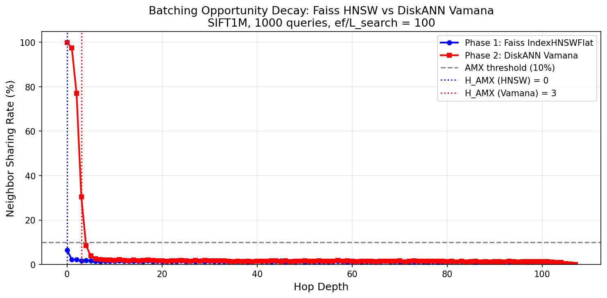

# AMX Graph ANNS

Characterizing and accelerating graph-based approximate nearest
neighbor search with Intel AMX.

NJIT Honors Summer Research Initiative 2026

Advisor: Prof. Xiaoning Ding

---

## Research Question

Can the AMX query-batching approach proven for IVF-based ANNS in CABANA
be extended to graph-based ANNS, and what graph structural properties
determine the feasibility and magnitude of that acceleration?

---

## Phase 1: Faiss IndexHNSWFlat

**Algorithm:** HNSW

**Library:** Faiss

**Dataset:** SIFT1M, 1M vectors, d=128

**Parameters:** M=16, ef_construction=200, ef_search=100

**Queries:** 1000

**Result:**

Sharing rate at hop 0: 6.47%

H_AMX at 5% threshold: 0

Max hop depth: 103

Sharing never exceeds the AMX efficiency threshold at any depth.
HNSW's upper layer greedy descent disperses queries to different
entry points before layer 0 search begins, eliminating sharing
immediately. AMX GEMM batching provides negligible benefit for
Faiss HNSW in its current form.

---

## Phase 2: DiskANN Vamana

**Algorithm:** Vamana

**Library:** DiskANN

**Dataset:** SIFT1M, 1M vectors, d=128

**Parameters:** R=32, L_build=125, alpha=1.2, L_search=100

**Queries:** 1000

**Result:**

Sharing rate at hop 0: 99.9%

Sharing rate at hop 1: 97.4%

Sharing rate at hop 2: 76.9%

Sharing rate at hop 3: 30.3%

Sharing rate at hop 4: 8.5%

H_AMX at 5% threshold: 4

Max hop depth: 107

All 1000 queries start from the same fixed medoid node and evaluate
the exact same 32 neighbors at hop 0, giving 99.9% sharing. Paths
diverge rapidly, dropping below 5% by hop 5. A strong AMX batching
window exists for hops 0 through 4.

---

## Phase 3: Faiss IVF (Baseline Validation)

**Algorithm:** IVF

**Library:** Faiss

**Dataset:** SIFT1M, 1M vectors, d=128

**Parameters:** nlist=1024, nprobe sweep [8, 16, 32, 64, 128]

**Queries:** 1000

**Result:**

| nprobe | Sharing Rate | Clusters shared by 2+ | Clusters shared by 8+ |
|--------|-------------|----------------------|----------------------|
| 8      | 87.3%       | 97.3%                | 47.6%                |
| 16     | 93.6%       | 99.7%                | 85.3%                |
| 32     | 96.8%       | 99.9%                | 96.1%                |
| 64     | 98.4%       | 100%                 | 99.4%                |
| 128    | 99.2%       | 100%                 | 100%                 |

IVF shows extremely high cluster sharing across all nprobe values.
At nprobe=32, essentially all cluster accesses are shared by 2+
queries, enabling near-perfect GEMM batching. This confirms CABANA's
findings on SIFT1M and validates our measurement methodology.

---

## Key Finding

Three algorithms show fundamentally different batching opportunity
profiles:

| Algorithm | Max Sharing | AMX Opportunity |
|-----------|-------------|-----------------|
| IVF | 87-99% | Extremely high |
| Vamana | 99.9% at hop 0, H_AMX=4 | Strong in early hops |
| HNSW | 6.5% at hop 0, H_AMX=0 | Negligible |

IVF has near-perfect sharing because its cluster structure guarantees
multiple queries probe the same vectors. This confirms CABANA and
validates our measurement methodology.

Vamana has strong sharing in early hops because all queries start
from the same fixed medoid node. At hop 0, all 1000 queries evaluate
the exact same 32 neighbors giving 99.9% sharing. Paths diverge
rapidly, dropping below 5% by hop 5.

HNSW has negligible sharing because its hierarchical design runs a
greedy descent through upper layers before layer 0 search begins.
This disperses queries to different entry points, eliminating sharing
before the main search even starts.

**Implication:** Vamana is the primary target for AMX acceleration.
The batch controller will exploit the H_AMX=4 window by fusing
distance computations across queries as GEMM for hops 0-4, falling
back to per-query GEMV beyond that depth.

---

## Repository Structure

## Repository Structure

- `faiss_instrumented/`     Faiss HNSW instrumentation patch and C++ driver
- `vamana_instrumented/`    DiskANN Vamana instrumentation patch and C++ driver
- `amx/`                    Standalone AMX GEMM validation and batch scaling tests
- `ivf_baseline/`           IVF baseline driver for Granite Rapids
- `analysis/`               Decay curve analysis, IVF sharing analysis, and plotting scripts
- `results/`                Output CSVs and figures for all three algorithms
- `results/granite_rapids/` Baseline QPS numbers, decay curves, and profiling on Granite Rapids
- `notes/`                  Paper drafts and meeting notes

---

## Phase 4: Granite Rapids Hardware Validation

**Hardware:** Intel Xeon 6767P (Granite Rapids), 256 cores, 251GB RAM
**AMX:** amx_bf16, amx_tile, amx_int8 confirmed

### Vamana Threading Baseline

| Threads | QPS | Recall@10 |
|---------|-----|-----------|
| 1 | 4,589 | 99.14% |
| 2 | 8,566 | 99.14% |
| 4 | 12,915 | 99.14% |
| 8 | 23,093 | 99.14% |
| 16 | 43,377 | 99.14% |
| 32 | 80,211 | 99.14% |
| 64 | 142,097 | 99.14% |
| 128 | 176,259 | 99.14% |
| 256 | 109,964 | 99.14% |

Peak throughput at 128 threads (176,259 QPS). Performance degrades
at 256 threads due to memory bandwidth saturation, confirming
graph ANNS is memory-bound. AMX batching targets this bottleneck
by increasing compute intensity per memory load.

### IVF Threading Baseline

| nprobe | QPS | Recall@10 |
|--------|-----|-----------|
| 1 | 204,491 | 0.9490 |
| 4 | 363,840 | 1.0000 |
| 8 | 181,729 | 1.0000 |
| 16 | 94,536 | 1.0000 |
| 32 | 48,436 | 1.0000 |
| 64 | 25,146 | 1.0000 |
| 128 | 11,901 | 1.0000 |

Peak throughput at nprobe=4 (363,840 QPS) with perfect recall.
IVF is ~2x faster than Vamana at matched high recall, confirming
cluster structure enables better hardware utilization than graph
traversal.

### AMX GEMM Validation

Standalone GEMM benchmark confirms AMX tile instructions are
operational on Granite Rapids:

- 47x speedup over naive triple-loop at batch size 32
- Correctness verified: max absolute difference 0.000008 (PASS)
- Cache boundary discovered at batch 64: sub-32 batches are
  cache-resident at ~2us, batches 64+ pay a fixed ~12us memory
  cost but GFLOPS scales continuously to 3440 at batch 10000
  with no plateau visible

**Implication for batch controller:** two operating regimes exist.
Fire at batch <=32 for latency-sensitive workloads. Accumulate
1000+ queries for maximum throughput.

### H_AMX Confirmation

Vamana decay curves regenerated on Granite Rapids confirm H_AMX=4
matches IdeaPad results exactly. Sharing rate is a property of
the algorithm and dataset, not the hardware.

---

## Phase 5: Hardware Profiling

Tool: perf stat, single threaded, SIFT1M, 1000 queries

| Metric | Vamana | IVF |
|--------|--------|-----|
| Cache miss rate | 60.77% | 21.07% |
| Instructions per cycle | 1.30 | 0.48 |
| LLC load miss rate | 24.49% | 24.85% |

Vamana's 60.77% cache miss rate confirms graph traversal is
memory-bound — the CPU spends most of its time waiting for data,
not computing. IVF's lower miss rate reflects its cache-friendly
sequential cluster scans. AMX batching addresses Vamana's bottleneck
by amortizing memory loads across concurrent queries, increasing
compute intensity per load.

---

- `amx/`                  Standalone AMX GEMM validation and batch scaling tests
- `ivf_baseline/`         IVF baseline driver for Granite Rapids
- `results/granite_rapids/` Baseline QPS numbers and decay curves on Granite Rapids
